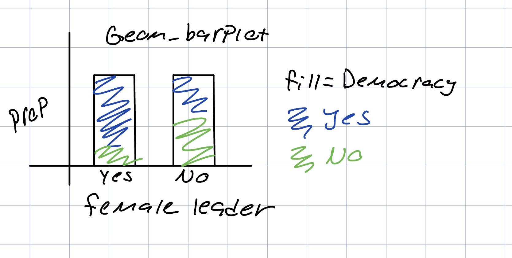
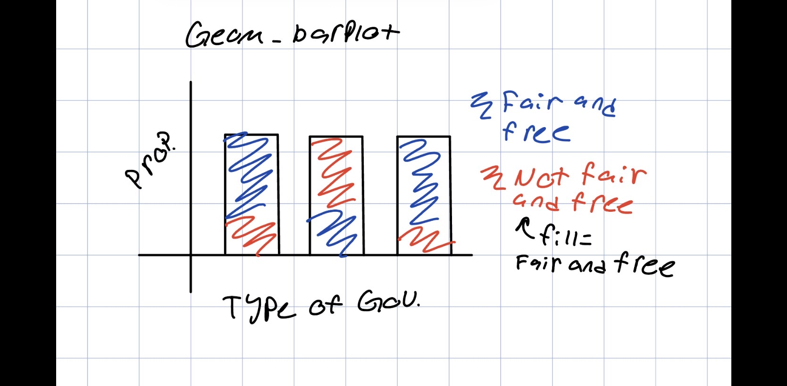

## Describing the context of the data
This data has information on regimes of countries from 1950 to 2022. This includes what type of government the country has, who the ruler is, if they have fair and free elections, and tons of more information.

## Data Cleaning
There has been a fair amount of data cleaning done to the set. This includes renaming the variables, turning placeholder data (e.g. ?) into missing values, and splitting a month/year field into two separate variables.

## Research Question from this Data
How does the type of government a country has relate to if they have fair and free elections?
  
  How does a country having a female leader relate to if the country is a democracy?
  
## Research Questions with Supplemental Data

  If we had GDP information: How do regime changes affect a countries GDP?
  If we had birth rates: Do countries with democracy have higher birthrates than countries that are non-democracy?
  
## Visuals
  
  
